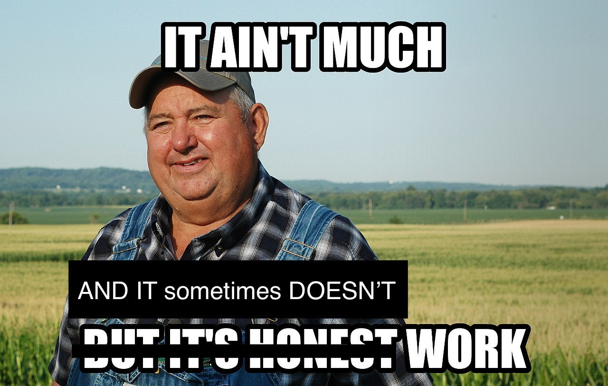

# ⌨️ Advent of Code 2023 solutions

This repository contains my solutions to the [Advent of Code 2023](https://adventofcode.com/2023) challenges. Advent of Code is an Advent calendar of small programming puzzles for a variety of skill sets and skill levels.

## Challenges

The challenges are designed to be solved in any programming language and cover a wide range of topics, including:

- Parsing and processing text
- Implementing algorithms and data structures
- Simulating simple systems and state machines
- Solving mathematical problems

Each day's challenge is divided into two parts, with the second part typically building upon the first part in some way. The challenges are designed to be approachable for beginners, but also offer a challenge for more experienced programmers.

### Directory structure

Each day of the Advent of Code challenge is organized into its own directory, named dayXX, where XX is the day of the challenge (e.g., day01, day02, etc.). Inside most of the day's directories, you will find the following files:

- `app_01.js`: The solution to the first part of the day's challenge.
- `app_02.js`: The solution to the second part of the day's challenge.
- `input.txt`: The input data provided by the Advent of Code system for the day's challenge.
- `test_input.txt`: A sample of the input data for testing purposes.

### Running the challenges

From my side, I used JavaScript to solve these challenges and from day08, took the opportunity to try [Bun](https://bun.sh/) as a new Javascript runtime.
You can navigate through the directory and run `bun app_01.js` or `bun app_02.js` (it should also work with `node`) to get the answers of the challenges.
Note that each participant gets a different dataset to work on, therefore, the answers of my challenges may not be the same as yours.

### Disclaimer

Some of these mind twisting challenges remained unsolved unfortunatly...

## Contact information

You can contact me via:

- [LinkedIn](https://www.linkedin.com/in/cl3mcg/?locale=en_US)
- [Mastodon](https://fosstodon.org/@cl3mcg)
- [Twitter](https://twitter.com/cl3mcg)

## License

This project and work is licensed under the [CC0 license](https://creativecommons.org/publicdomain/zero/1.0/).
