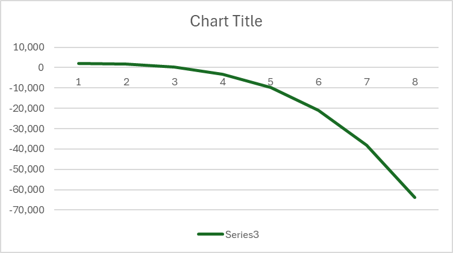
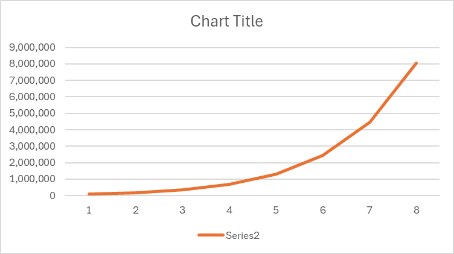

# Notes

## Mental path to solve Part 1

I beleive we are reaching the boundaries of what i am able to solve with my limited time.

I tried to kickstart this problem solving with a zest of help from MistralAI and it didn't really help.

So I re-read the problem given, and I noticed that the most important part was about the differences between the numbers given.

I decided to do a test on 2 series of numbers and substracted each given number to put the difference between 2 numbers into Excel.
I then drafted a chart based on the suite of numbers.
I noticed that the difference between the numbers is always growing, and once the points plotted on a chart, the difference between the numbers clearly appears to be part of an exponential function.

Therefore, there might be a way to find out what is the function if we have the y value of the points (knowing that x would be 0, 1, 2, 3 etc.).
If we can find this out, I can find the value of the difference between the last point and the expected next point.
If I know the difference, I can deduct the y value of x+1.

Then, i just need to store these value inside an array, do a reduce method to add all of the array's number and find out the final result.

Exponential functions typically have the form `y = a * b^x`, where a and b are constants.
So we obviously already have x, and we know how to get y (the difference between 2 numbers).
Now the challenge is to find what is a and b (especially considering that I left high school 15 years ago...).

We need to consider two expressions and divide them, so we can single out a and b.

$$
\begin{align}
y_1 &= a \cdot b^{x_1} \
\end{align}
$$

$$
\begin{align}
y_2 &= a \cdot b^{x_2}
\end{align}
$$

We divide these:

$$
\frac{y_2}{y_1} = \frac{a \cdot b^{x_2}}{a \cdot b^{x_1}}
$$

We can take out the value of a

$$
\frac{y_2}{y_1} = \frac{b^{x_2}}{b^{x_1}}
$$

And...that's it for me, I can't go further on my own.
So I prepared a prompt to MistralAI to unstuck me on this one.

## Help from LLM

I'd be happy to show you how to solve this system of equations step by step. Let's start with the given system of equations:

$$
\begin{align}
y_1 &= a \cdot b^{x_1} \
\end{align}
$$

$$
\begin{align}
y_2 &= a \cdot b^{x_2}
\end{align}
$$

Divide the second equation by the first equation to eliminate `a`:

$$
\frac{y_2}{y_1} = \frac{a \cdot b^{x_2}}{a \cdot b^{x_1}}
$$

The a terms cancel out:

$$
\frac{y_2}{y_1} = \frac{b^{x_2}}{b^{x_1}}
$$

Using the property of exponents that says `(b^m) / (b^n) = b^(m-n)`, we can simplify the equation:

$$
\frac{y_2}{y_1} = b^{(x_2 - x_1)}
$$

Take the natural logarithm (`ln`) of both sides to solve for b:

$$
\ln{\left(\frac{y_2}{y_1}\right)} = \ln{\left(b^{(x_2 - x_1)}\right)}
$$

Using the property of logarithms that says `ln(b^m) = m \* ln(b)`, we can simplify the equation:

$$
\ln{\left(\frac{y_2}{y_1}\right)} = (x_2 - x_1) \cdot \ln{(b)}
$$

Now, divide both sides by `(x2 - x1)` to isolate ln(b):

$$
\ln{(b)} = \frac{\ln{\left(\frac{y_2}{y_1}\right)}}{(x_2 - x_1)}
$$

Finally, to find `b`, take the exponential of both sides (since `e^(ln(b)) = b`):

$$
b = e^{\left(\frac{\ln{\left(\frac{y_2}{y_1}\right)}}{(x_2 - x_1)}\right)}
$$

Substitute the value of `b` back into one of the original equations to solve for `a`. We'll use the first equation:

$$
y_1 = a \cdot b^{x_1}
$$

Divide both sides by `b^x1` to isolate a:

$$
a = \frac{y_1}{b^{x_1}}
$$

Now you have the values of a and b for the exponential function `y = a \* b^x`. You can use these values to find the next y value for `x+1` by plugging in the value of `x+1` into the equation and calculating the corresponding `y` value.
